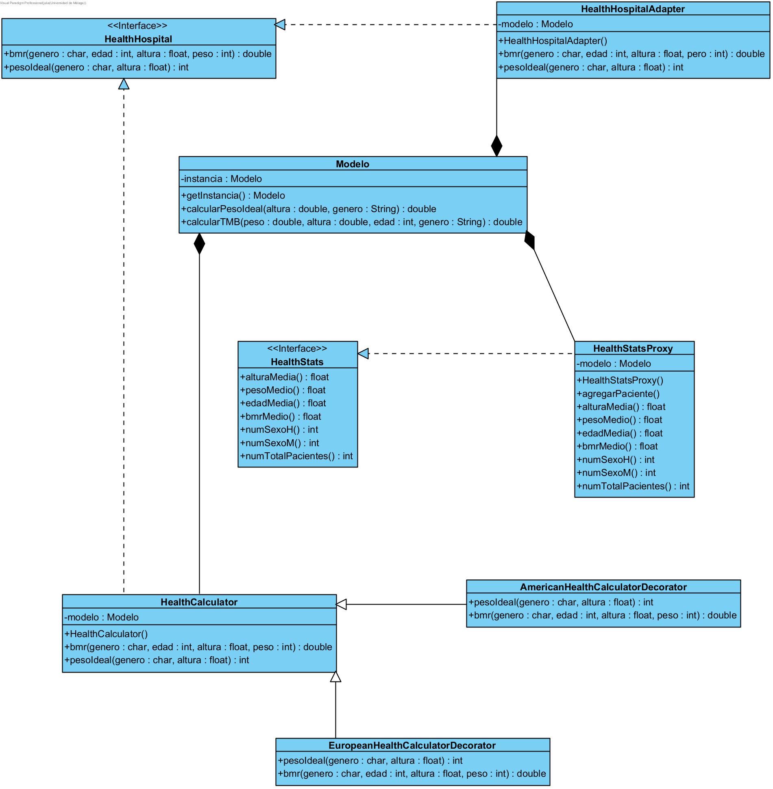

# HEALTH CALCULATOR JULIA DEL RÍO

## PRÁCTICA 1

### Tests método 'HealthCalcImpl.idealWeight'

A continuación, inserto una enumerción de los casos de prueba que he considerado convenientes realizar para comprobar el correcto funcionamiento del método idealWeight.

1. **Test Altura Negativa**: Comprueba que el sistema actúa correctamente al introducirse una altura negativa.
2. **Test Altura Cero**: Se comprueba que se lanza una excepción al introducir una altura igual a cero.
3. **Test Peso Ideal Negativo**: El sistema debe rechazar un cálculo de peso ideal negativo.
4. **Test Altura Máxima Permitida**: El sistema lanza una excepción cuando la altura excede el límite máximo permitido por el tipo de dato.
5. **Test Género No Válido**: El sistema lanza una excepción para entradas de género que no sean "H" (hombre) o "M" (mujer).
6. **Test Peso Ideal Hombre**: Comprueba el cálculo correcto del peso ideal basándose en la fórmula para el género masculino y confirmando que el resultado coincide con el esperado.
7. **Test Peso Ideal Mujer**: Este test sirve para lo mismo que el anterior solo que ahora estudiamos el caso del género femenino.

### Tests método 'HealthCalcImpl.basalMetabolicRate'

En este otro apartado, se incluye otra lista de los casos de prueba para comprobar el funcionamiento del método basalMetabolicRate.

1. **Test Altura Negativa**: Verifica que se lanza una excepción al introducir una altura negativa.
2. **Test Altura Cero**: Se comprueba que la aplicación lanza una excepción al encontrar una altura igual a cero.
3. **Test Peso Negativo**: El sistema debe rechazar correctamente un valor de peso negativo.
4. **Test Edad Negativa**: Parecida a la anterior, pero en este caso lanza la excepción si se introduce una edad negativa.
5. **Test Peso Cero**: El sistema lanza una excepción al recibir un valor de peso igual a cero.
6. **Test Edad Cero**: El sistema debe reaccionar igual que en el test anterior, pero esta vez al encontrarse con una edad igual a cero.
7. **Test Altura Máxima Permitida**: Se comprueba que la aplicación lanza una excepción cuando la altura excede el límite máximo permitido por el tipo de dato.
8. **Test Peso Máximo Permitido**: Al igual que en el test anterior, se comprueba que la aplicación lanza una excepción cuando el valor del peso excede el límite máximo permitido por el tipo de dato.
9. **Test Edad Máxima Permitida**: Este otro también comprueba que se lanza una excepción cuando la edad supera el límite según el tipo de dato.
10. **Test Metabolismo Basal Negativo Hombre**: Con este test nos aseguramos de que el sistema rechaza un cálculo que resulte negativo en el caso del génro masculino.
11. **Test Metabolismo Basal Negativo Mujer**: Con este test nos aseguramos de que el sistema rechaza un cálculo que resulte negativo en el caso del género femenino.
12. **Test Género No Válido**: El sistema lanza una excepción para entradas de género que no sean "H" (hombre) o "M" (mujer).
13. **Test Metabolismo Basal Mujer**: Cálculo correcto del metabolismo basal para una mujer.
14. **Test Metabolismo Basal Hombre**: Cálculo correcto del metabolismo basal para un hombre.

### Resultado de los test

En este apartado, voy a añadir una captura de mi consola en la que se puede observar que todos los test mencionados anteriormente se ejecutaron correctamente.

### Registro de commits

Por último, tal y como se nos pide en la última parte de la práctica, adjunto una imagen donde podemos ver el registro de los commits que he realizado durante el desarrollo de dicha práctica.
Cabe destacar que hay más commits de la cuenta para insertar la primera imagen puesto que no me salía bien y lo he intentado muchas veces.

## PRÁCTICA 2

### Diagrama Casos de Uso

A continuación, insertamos una imagen en la que se representa un diagrama de casos de uso de este proyecto.

### Explicación del caso de uso "Calcular Ingesta Calórica Diaria Recomendada"

* Nombre: Calcular Ingesta Calórica Diaria Recomendada
* Actor principal: Usuario
* Ámbito: Sistema de la calculadora de salud
* Nivel: Nivel de usuario
* Stakeholders e intereses:
  - Usuario: Interesado en conocer la cantidad de calorías que debe consumir diariamente para mantener su peso o alcanzar sus objetivos de salud.
  - Desarrolladores: Interesados en implementar y mantener correctamente esta funcionalidad en el sistema.
* Precondiciones:
  - El usuario debe tener acceso al sistema de la calculadora de salud.
  - El usuario debe proporcionar su información personal, como peso, altura, edad, género y nivel de actividad física.
* Garantías mínimas: El sistema debe realizar el cálculo correctamente según las fórmulas establecidas para estimar la ingesta calórica diaria recomendada.
* Garantía de éxito: El sistema proporcionará al usuario la cantidad de calorías que debe consumir diariamente de manera precisa y confiable, teniendo en cuenta sus características individuales y objetivos de salud.
* Escenario principal:
  1. El usuario ingresa su peso en kilogramos.
  2. El usuario ingresa su altura en metros.
  3. El usuario ingresa su edad en años.
  4. El usuario selecciona su género (hombre o mujer).
  5. El usuario selecciona su nivel de actividad física (sedentario, poco activo, moderadamente activo, muy activo o extremadamente activo).
  6. El sistema calcula la ingesta calórica diaria recomendada utilizando la fórmula correspondiente, que puede basarse en la tasa metabólica basal (TMB) y el nivel de actividad física del usuario.
  7. El sistema muestra al usuario el resultado del cálculo.
* Escenarios alternativos: Si el usuario proporciona valores no válidos para alguna de las variables, el sistema mostrará un mensaje de error y solicitará al usuario que proporcione valores válidos.
* Extensiones:
  - El sistema podría ofrecer recomendaciones adicionales, como sugerencias para distribuir las calorías diarias entre los diferentes macronutrientes (proteínas, carbohidratos y grasas) según los objetivos de salud del usuario.
  - También podría proporcionar información adicional sobre hábitos alimenticios saludables y sugerencias para alcanzar los objetivos de salud específicos del usuario.

## PRÁCTICA 3

### Historias de Usuario
__HISTORIA DE USUARIO 1: Cálculo del Índice de Masa Corporal (IMC)__

Como usuario interesado en conocer mi estado de salud relacionado con mi peso y altura

Quiero poder calcular mi Índice de Masa Corporal (IMC) utilizando la calculadora de salud

Para entender si mi peso está dentro de un rango saludable según mi altura

Escenarios de aceptación:

1. Dado que soy un hombre de 35 años, peso 80 kg y mido 175 cm, cuando ingreso estos datos en la calculadora, entonces debo recibir un resultado que estime mi IMC.
2. Dado que soy una mujer de 28 años, peso 60 kg y mido 160 cm, cuando ingreso estos datos en la calculadora, entonces debo recibir un resultado que estime mi IMC.
3. Dado que intento calcular mi IMC y proporciono una altura negativa, la calculadora debe mostrar un mensaje de error indicando que la altura no puede ser negativa.

__HISTORIA DE USUARIO 2: Cálculo de ingesta calórica diaria recomendada__

Como usuario interesado en mantener una dieta saludable

Quiero poder calcular mi ingesta calórica diaria recomendada utilizando la calculadora de salud

Para planificar adecuadamente mi alimentación y controlar mi peso.

Escenarios de aceptación:

1. Dado que soy un hombre de 30 años, peso 80 kg y mido 175 cm, cuando ingreso estos datos en la calculadora, debo recibir un resultado que estime mi ingesta calórica diaria recomendada.
2. Dado que soy una mujer de 25 años, peso 60 kg y mido 160 cm, cuando ingreso estos datos en la calculadora, debo recibir un resultado que estime mi ingesta calórica diaria recomendada.
3. Dado que intento calcular mi ingesta calórica diaria recomendada y proporciono una altura negativa, la calculadora debe mostrar un mensaje de error indicando que la altura no puede ser negativa.
4. Dado que intento calcular mi ingesta calórica diaria recomendada y proporciono un peso negativo, la calculadora debe mostrar un mensaje de error indicando que el peso no puede ser negativo.
5. Dado que intento calcular mi ingesta calórica diaria recomendada y proporciono una edad negativa, la calculadora debe mostrar un mensaje de error indicando que la edad no puede ser negativa.

## PRÁCTICA 4: INTERFAZ GRÁFICA DE USUARIO

El boceto seguido para el diseño de la interfaz gráfica es el siguiente:

Y lo obtenido ha sido:

## PRÁCTICA 6: PATRONES DE DISEÑO

A continuación, se adjunta una imagen del diagrama UML obtenido en cada apartado de la práctica junto con la especificación del patrón de diseño utilizado.

__APARTADO 2__

En este apartado, como se indica en él, se ha utilizado el patrón *Singleton*.

__APARTADO 3A__

En este otro, se ha implementado el patrón *Adapter*, tal y como se puede observar a continuación.

__APARTADO 3B__

Ahora hemos usado el *Proxy*.

__APARTADO 3C__

Y, por último, en este se ha usado el patrón *Decorator*.

